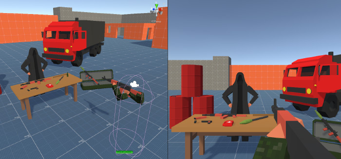
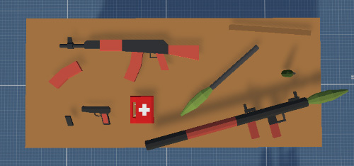
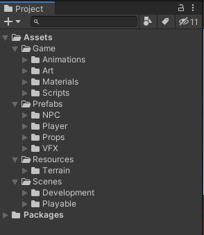
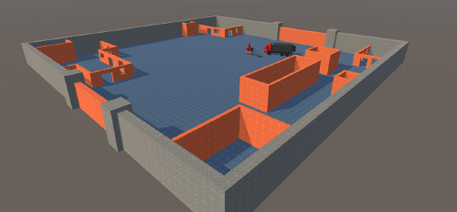
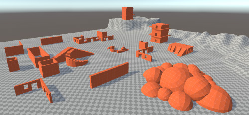

 
[](https://twitter.com/AlekseyMelkor)
[](https://github.com/amelkor/Unity3d-BSR-Shooter-Trial/blob/master/LICENSE.md)
[](https://github.com/amelkor/Unity3d-BSR-Shooter-Trial/blob/master/LICENSE-ART.md)
# BSR Trial Shooter
#### This repository contains a set of assets and issues to get started with Unity3d simple FPS game development.
## What is this for?
- This your side project if you're eager to put any amount of effort to a game development process
- This is your place to follow in case you got hoocked by the pitched artwork above and below
- This is your trial ground if you've been invited to complete a task as a basic skill checking
- This is to collect and organize some assets which are not prohibited for sharing

## Prequisites
These tools are required to get started:
- Unity3d 2020.1.17 [Download](https://unity3d.com/ru/get-unity/download) | [Unity guide](https://docs.microsoft.com/en-us/visualstudio/gamedev/unity/get-started/getting-started-with-visual-studio-tools-for-unity?pivots=windows)
- _Option 1:_ Visual Studio 2019 Community (for programmers) (free) [Download](https://visualstudio.microsoft.com/vs/community/)
- _Option 2:_ JetBrains Rider (for programmers) (free trial) [Download](https://www.jetbrains.com/rider/)  | [Unity guide](https://www.jetbrains.com/help/rider/Unity.html)
- _Option 3:_ VS Code (for programmers) (free) [Download](https://code.visualstudio.com/download) | [Unity guide](https://code.visualstudio.com/docs/other/unity)
- Blender 2.91 (for artists) (free) [Download](https://www.blender.org/download)

## Conventions
The following must be respected for contributions:
- No commercial, copyrighted, or public domain 3d models are allowed
- No commercial or copyrighted art images are allowed
- No offencive or explicitly discriminational assets

## Project description
The project is set up for practicing game development processes. The features are distributed into separated tasks with description of what work needs to be performed.

The game itself is a First Person Shooter with common FPS mechanics.



The repository initially comes with project strucure organized and basic artwork added.



There are two scenes included:

 

## Contributing
Feel free to add an artwork and documentation if you are not into programming. If you're not able to code but want to give a try then create an issue or go to Discussions and describe what you'd up to. Poposals are also welcome. If you're able to code then go for it. Also do not hesistate sharing or leaving a comment.

See the `initial-blank` branch in case you need a clean initial version of this repository.

## Requesting additional atrwork
Additional artwork assets such as models and textures could be created by the repository owners if requested. Create an issue and describe what is needed.

## CI/CD
CI pipeline is coming once the project has made it to a playable state.

## Code style
For conviniency the chosen code style is close to the [Microsoft C# Coding Conventions](https://docs.microsoft.com/en-us/dotnet/csharp/programming-guide/inside-a-program/coding-conventions).

The code should keep things simple, easy to read and understand.

`MonoBehaviuor` derived classes should keep public inspector fields as private/internal with `[SerializeField]` attribute:
```c#
    public class PlayerController : MonoBehaviour
    {
        [Header("Settings")]
        [SerializeField] private float walkSpeed = 5f;

        [Header("References")]
        [SerializeField] private PlayerAnimator animator;
        [SerializeField] private new PlayerAudio audio;
        [SerializeField] internal Transform origin;
    }
```

In complex classes use regions to distinct vast logic blocks:

```c#
        #region inspector values
        // fields to be controlled within the Inspector
        #endregion

        #region private fields
        // fields are not to be exposed to the Inspector
        #endregion

        #region Unity loop
        private void Update()
        {
            // update loop
        }
        #endregion

        #region calculation
        // complex logic
        #endregion

        #region Editor
        // editor methods
        #endregion
```

Surround Editor methods with `UNITY_EDITOR` directive:

```c#
#IF UNITY_EDITOR
// editor only logic
#endif
```

Provide Summary description for key components and API methods:
```c#
    /// <summary>
    /// Controls incoming input to component.
    /// </summary>
    public interface IControlInput
    {
        /// <summary>
        /// Enable or disable any incoming input to the component.
        /// </summary>
        bool InputEnabled { get; set; }
    }
```

## Licensing
- BSR Trial Shooter code is licensed under the MIT License, see  [LICENSE.md](LICENSE.md) for more information.
- The artwork is licenced under the CC BY-NC 4.0 Licence, see [LICENSE-ART.md](LICENSE-ART.md) for more information.